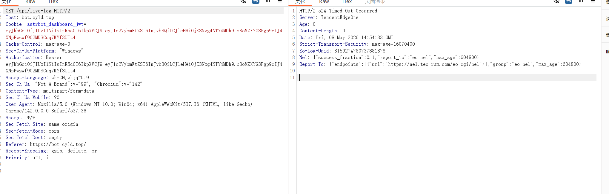
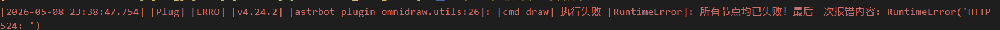
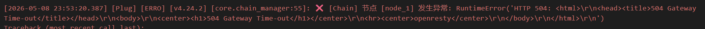
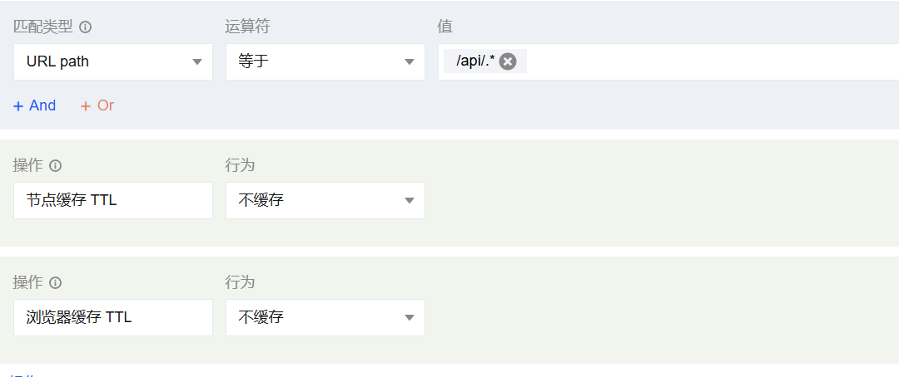

尽管CDN能加速网站的访问，但是，事实上很多时候它并不是那么智能，所以

我们有必要配置规则，来排除那些并不需要加速的部分。

首先从不是配置导致的问题开始：

**如果是出现data:{...这个非JSON格式：**

CDN需要开启Websocket协议（似乎并非必须）并且关闭gzip等压缩

::tip

阿里免费版ESA不支持ws，但是腾讯eo免费版是支持的。

付费的话虽然eo个人版看着贵些，不过实际年付差不多

::

**超时问题（通常出现在使用SSE协议的情况）:**

这种问题调一下超时时间，SSE很容易超时，要设一个非常大的（如3600s）

需要注意Nginx等中间件也要修改超时设置！

否则就会从一个超时变成另一个超时：

CDN超时

Nginx超时

如果是缓存的问题通常表现为：

需要实时刷新的部分，如验证码，日志等，被CDN缓存，导致始终无法得到刷新

首先要配置：

如果还不能解决，这时候就要抓包看看到底怎么个事：

> 我的探针出现过全掉线的问题，但那并不是因为缓存，而是因为没开启Websocket协议，在排查其他问题前要先看看**支持协议**，有些CDN不支持或者默认不开启，注意**SSE和Websocket完全不同**

后续发现似乎不用配置CDN也会自己识别是不是静态资源，这种最最基本的设置其实是多余的？（懒得删了再测了）