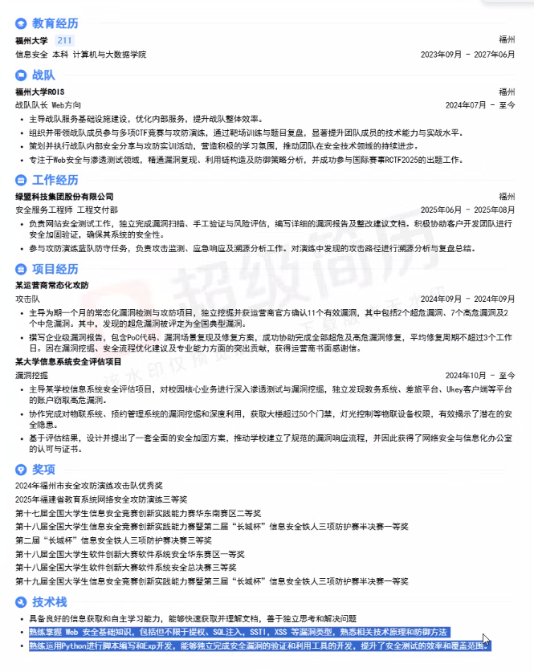

> 举个例子，lm秋招一面可能是问这些∶
>
> 渗透测试：Web、小程序、APP、PC客户端攻防演练：RCE漏洞原理（反序列化、文件上传、注入等）、信息收集、内网横向（代理搭建、域、权限维持）、代码审计应急响应：挖矿场景应急、webshell应急等场景AI：提示词注入、非法内容输出等漏洞原理、AI工具的使用开发不需要全部都精通，你就找一两个作为自己的优势亮点展示，其他的了解理论就行，别完全没接触了解就ok

