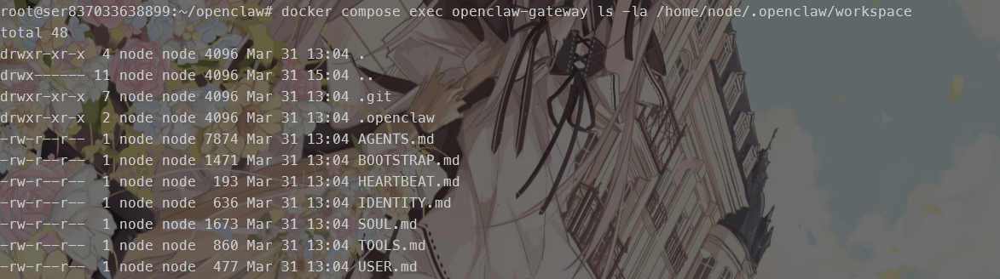
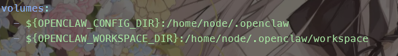
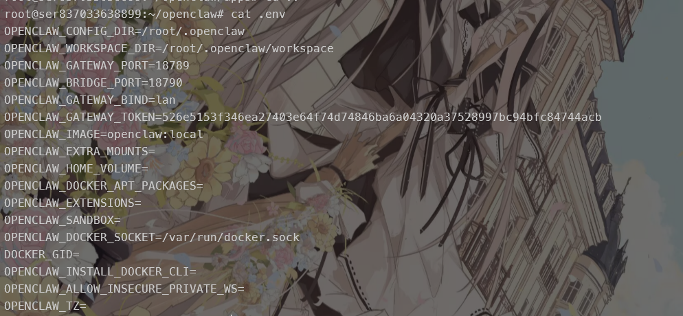
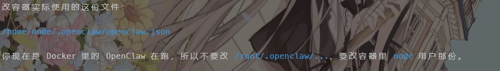

### 部署openclaw

为了防止服务器出问题，选择用docker来搭建，参考文章是：

 [在 Docker 中运行 OpenClaw：手把手部署指南 | OpenClaw Blog](https://openclaws.io/zh/blog/openclaw-docker-deployment) 

配置完成后，面板登录不上去有：

`origin not allowed (open the Control UI from the gateway host or allow it in gateway.controlUi.allowedOrigins)`

这是因为webui有验证浏览器的Origin，这个配置默认是接受来自127.0.0.1的访问，后续我将其修改成了服务器ip

```bash
docker compose run --rm --no-deps --entrypoint node openclaw-gateway dist/index.js config set gateway.controlUi.allowedOrigins '["http://xxx.xxx.xxx.xxx:18789"]' --strict-json

docker compose up -d openclaw-gateway
//查看当前配置
docker compose run --rm --no-deps --entrypoint node openclaw-gateway dist/index.js config get gateway.controlUi.allowedOrigins
```

但是遇到了另一个问题

`control ui requires device identity (use HTTPS or localhost secure context)`

这是因为我们使用的远程ip+HTTP访问并不安全，服务器无法生成设备身份

有一种办法是使用ssh隧道来访问：

```bash
ssh -N -L 18789:127.0.0.1:18789 root@149.88.85.179
//登录后不会有任何反馈，但是不影响，直接本地浏览器访问127.0.0.1:18789 即可（建议操作时把魔法都关掉）而且如果你和我一样操作，需要把上面的配置重新修改为127.0.0.1（或者至少加回去）
```

这种方法最为简便，只是有些麻烦，而且shell的超时也会被触发

当然你也可以直接配置域名证书，然后反代过去（可能遇到其他问题），所以这里建议还是使用ssh隧道，也不用额外开端口之类的。

当出现`pairing required`时执行：

```bash
docker compose run --rm openclaw-cli dashboard --no-open
docker compose run --rm openclaw-cli devices list
docker compose run --rm openclaw-cli devices approve --latest
#这里--rm实际上是因为这个容器是通过更改共同的挂载目录来实现对应功能的，所以不需要留着
```

:::note

list可能有多个（请求配对不止一次），`--lastest`只是接受了最新的一个

:spoilter[尽管一般来说没什么问题]

:::

如果纯使用配置，后续换模型：

```bash
docker compose run --rm openclaw-cli models set openrouter/free
```

:spoilter[其实这类小问题直接交给ai就行了]

有的模型会出现

```bash
Reasoning is required for this model endpoint. Use /think minimal (or any non-off level) and try again.
```

执行：

```bash
docker compose run --rm --no-deps --entrypoint node openclaw-gateway dist/index.js config set agents.defaults.thinkingDefault '"minimal"' --strict-json

docker compose up -d openclaw-gateway
```

如果有在容器里配置过，不想重建，那么可以进入容器后

修改/home/node/.openclaw/openclaw.json

```json
{
    "agents": {
      "defaults": {
        "thinkingDefault": "minimal"
      }
    }
  }
```

关于龙虾的基础设定，在

```bash
docker compose exec openclaw-gateway ls -la /home/node/.openclaw/workspace
```



实际上默认情况下，这个目录和配置目录都是有挂载的



在宿主机目录里.env



### 接入napcat

napcat这里直接放在宿主机里，就不使用docker了，方便操作

最开始看的是

[linux部署NapCat QQ机器人-CSDN博客](https://blog.csdn.net/kttiny/article/details/153943906) 

方案，但是这东西不大好用，得自己想办法挂后台，找配置文件修改

而且**没有cli**。

总之就是不推荐

建议使用官方安装器

```bash
curl -o napcat.sh https://nclatest.znin.net/NapNeko/NapCat-Installer/main/script/install.sh

sudo bash napcat.sh --tui --cli y
```

下载对应的插件时可能会遇到被openclaw认为危险而阻止安装的情况

```bash
Extracting /tmp/openclaw-npm-pack-bFuhWY/hyl_aa-napcat-1.2.5.tgz…
WARNING: Plugin "napcat" contains dangerous code patterns: Shell command execution detected (child_process) (/tmp/openclaw-plugin-Lc6BjN/extract/package/src/monitor.ts:202)
Downloading @hyl_aa/napcat…
Extracting /tmp/openclaw-hook-pack-0ERHov/hyl_aa-napcat-1.2.5.tgz…
Plugin "napcat" installation blocked: dangerous code patterns detected: Shell command execution detected (child_process) (/tmp/openclaw-plugin-Lc6BjN/extract/package/src/monitor.ts:202)
Also not a valid hook pack: Error: package.json missing openclaw.hooks
```

这时可以进入getway容器，使用下列任意一个方式

- 直接用npm安装

- 更改设置 `echo '{"checkDangerousCode":false}' > /app/config.json `

随后重启容器

:::caution

需要以root身份安装，belike:

```bash
docker exec --user root openclaw-openclaw-gateway-1 npm install @hyl_aa/napcat --prefix /app/plugins --force
```

有的版本不兼容`--force`之类的方法，需要手动安装：

```bash
mkdir -p ~/.openclaw/extensions
cd ~/.openclaw/extensions
git clone https://github.com/Aliang1337/openclaw-napcat.git napcat
cd napcat
npm install --omit=dev
#使用root编辑完文件后，记得把权限和拥有者修改回去
```

:::

安装完成后，再次进入容器，添加配置

```
cat > /app/config.json << EOF
{
  "checkDangerousCode": false,
  "wsServer": {
    "enabled": true,
    "port": 18800,
    "token": "your_token"
  }
}
EOF
```


```
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
```

```
docker compose -f /root/openclaw/docker-compose.yml exec openclaw-gateway node dist/index.js health --token "f6935f37e1e8f50ab88e8833dd536583f9251667ae9f4b2ecf36bcba4a2f610b"
```

:::caution

napcat插件使用的是18800端口，需要映射出来供宿主机连接

默认情况下挂载的配置文件和容器实际使用的不载一个目录



还有就是：

**容器访问宿主机会触发宿主机的防火墙**

:::

配置，在openclaw.json中

```json
 {
    "channels": {
      "napcat": {
        "httpApi": "你的地址",
        "accessToken": "你的token",
        "selfId": "xxxx",
        "dmPolicy": "open",  //私聊
        "groupPolicy": "open"  //群聊
         //"dmPolicy": "allowFrom"
        //"allowFrom": ["你的QQ号"]
      }
    }
  }
```

一些调试用的语句

```bash
docker exec -u node openclaw-openclaw-gateway-1 sh -lc 'openclaw channels status --probe'

docker logs -f --since 10m openclaw-openclaw-gateway-1 2>&1 | grep -Ei 'napcat|agent|openrouter|send|reply|error|timeout|guardrail|fetch
  failed|reasoning'
```

