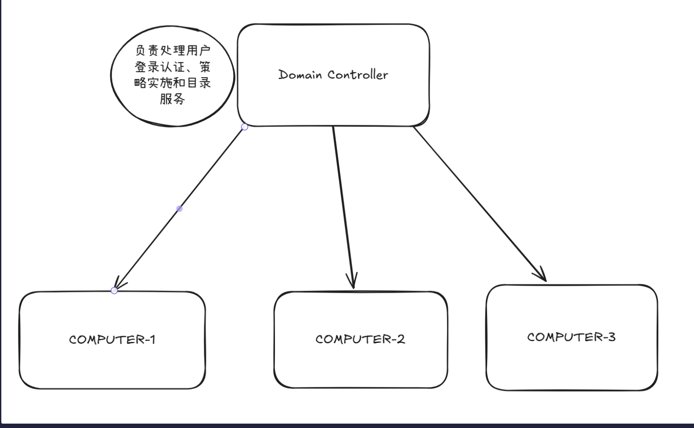
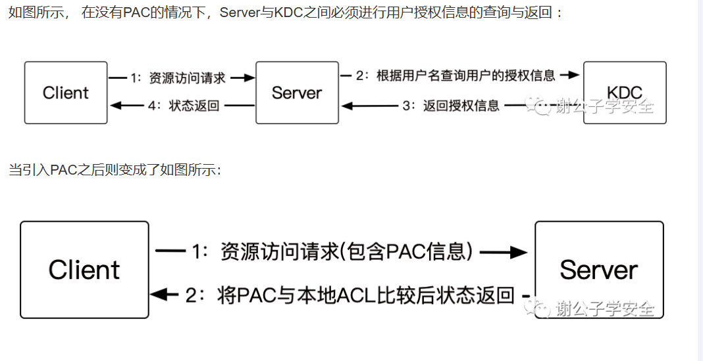
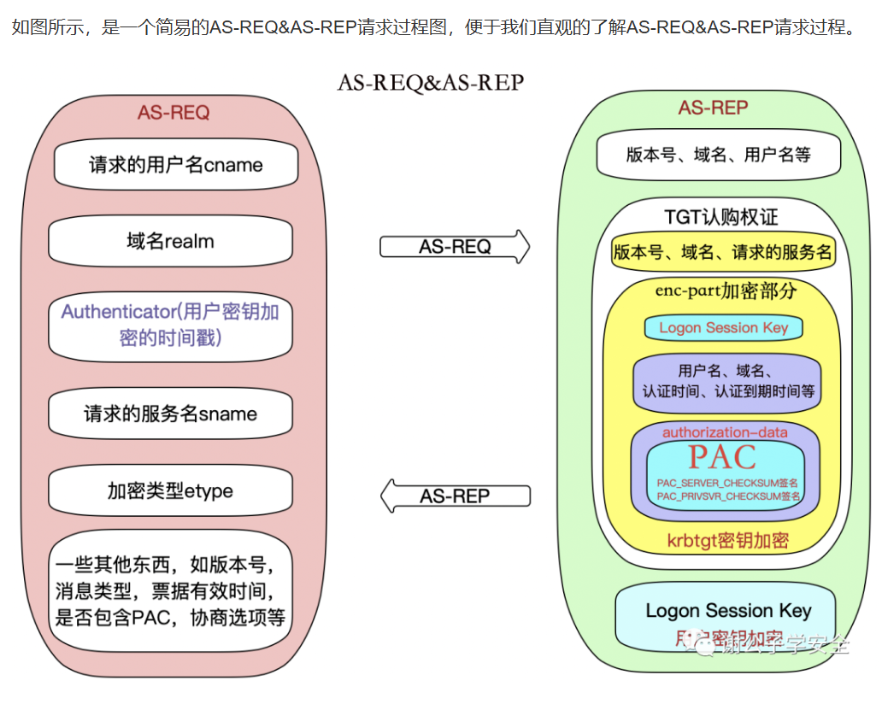
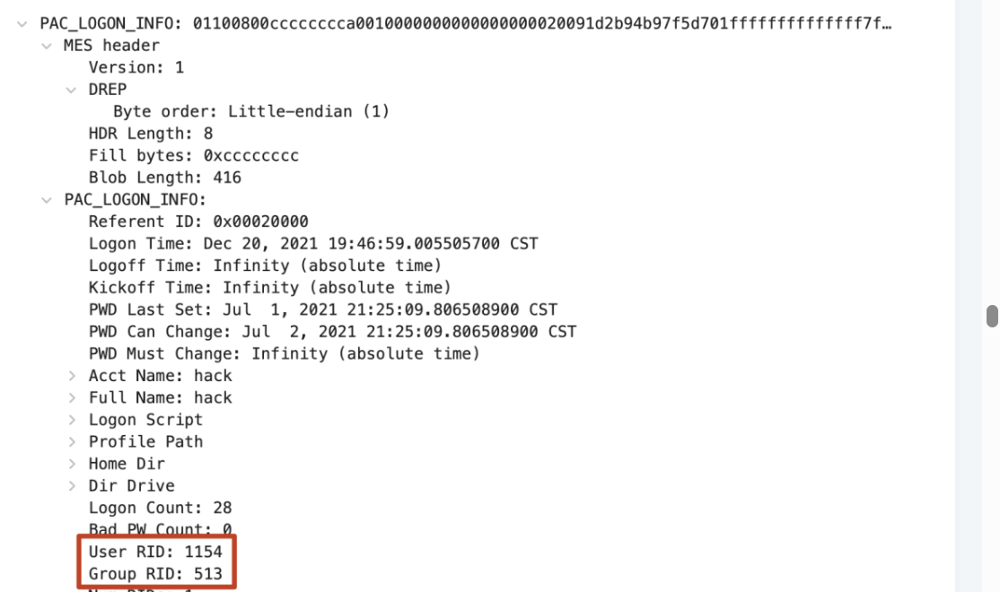
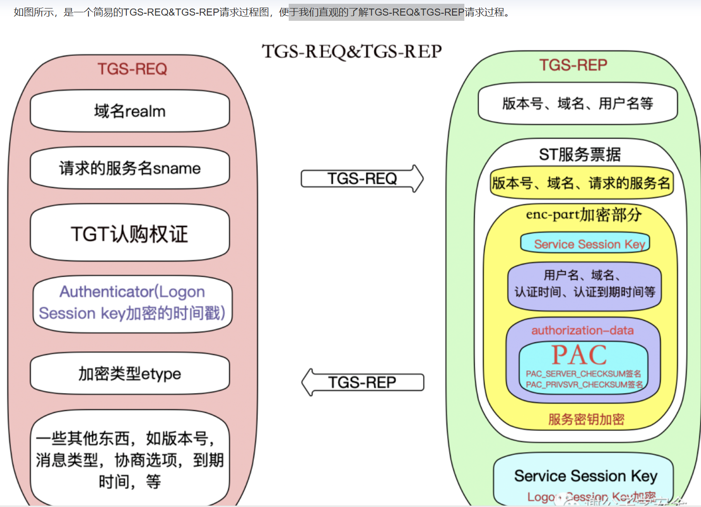

[参考链接，包含链接中的链接](https://www.cnblogs.com/rycarl/p/19272355)
## 简介
Windows域用于集中管理用户，计算机和其他网络资源的一种逻辑结构，实现统一的身份验证和资源访问控制，基于Active Directory(AD，活动目录)技术

1. 集中身份验证

在域环境中，所有的网络资源都是在域控制器上维护的，所有用户只要登录到域，就可以进行身份验证。

2. 统一策略管理

管理员可以通过组策略（GPO）配置安全设置，在域环境中还可以防止企业成员在域成员主机上违规安装软件

3. 资源集中管理
   
文件共享，打印机，应用系统等资源都可以按照用户和组进行权限分配

>其他特点：
>- 所有的登录请求都会发送到域控制器（DC），DC可以记录这些事件。
>- AD中的用户配置文件可以配置为**漫游配置文件**(Roaming Profile)，用户登录任何域计算机时，配置文件都要从服务器下载。这就意味着只要是这个用户的登陆的电脑，无论是域中的哪一台，都会自动拉取配置的服务器共享目录。
>文件夹重定向(Folder Redirection)，通过组策略将桌面，文档等文件夹指向网络共享，数据实际存储在服务器上。配合上漫游配置文件，可以做到在域中任何电脑登录，你的文件和桌面都在。
>- 通过组策略还可以分发MSI应用程序，WSUS（Windows Server Update Services）集中管理补丁，管理员可以强制或可选安装

文件访问，权限更改，登录事件等都会被记录在DC中。
## 身份验证
采用Kerberos协议在域控制器上进行

[协议介绍](https://cloud.tencent.com/developer/article/2227940)

Kerberos中的一些特有名词
- krbtgt：KDC密钥发行中心服务账户，存在于DC，在AC创建时自动创建，密码随机，不可登录
- KDC：密钥分发中心，由域控担任
- AD：活动目录，实际上是域内用户数据库
- AS：认证服务
- TGT：认购权证，KDC的AS发放，用于申请ST，表明这个域成员登录
- TGS：票据授予服务
- ST：服务票据，KDC的TGS发放，需要TGT，在有些情况下也用TGS表示（混用）

一般的Kerberos只验证身份，不验证权限，因此额外引入
### PAC
Privilege Attribute Certificate，特权属性证书，其中包含了各种授权信息等(如用户所属的组以及其权限)。KDC返回的TGT和ST中都带有PAC，这使得认证后就无需每次请求都验证，直接根据PAC和自身ACL即可判断

:::tip

PAC具有两个签名，一个由服务密钥签名，一个由KDC密钥签名，正常情况下服务端需把ST中的PAC发给KDC检验，但是这个功能**默认不会开启**，此时只要拥有服务密钥就可以伪造ST。这就是**白银票据攻击**
> 用服务密码哈希伪造ST，跳过了TGT(黄金票据)

:::

### AS-REQ & AS-REP

申请TGT时
#### AS-REQ
当域内用户访问域内某个服务时，**本机向KDC的AS**发送AS-REQ

请求包中只有PA-DATA PA-ENC-TIMESTAMP是加密的，这一部分属于预认证，称为Authenticator

PA-DATA PA-ENC-TIMESTAMP是用用户密码Hash加密时间戳，作为value发送给KDC的AS服务。然后KDC从活动目录中查询出用户的hash，使用用户Hash进行解密，获得时间戳，如果能解密，且时间戳在一定的范围内，则证明认证通过。

只要有用户密码Hash而不是密码本身，就可以伪造发送AS-REQ，实现**哈希传递攻击**

#### AS-REP
回复包，最重要的是TGT和加密的Logon Session Key，前者是用krbtgt的密码Hash加密，后者是用请求的用户的密码Hash加密的，如果知道了krbtgt的密码Hash，就可以直接伪造TGT，造成**黄金票据攻击**

##### ticket
对应TGT，其中的autherization-date中包含被加密的PAC
TGT解密后可以得到Logon Session Key，认证时间authtime、认证到期时间endtime、域名srealm、请求的服务名sname、协商标志flags等。

其中就包含用户&组RID
##### Logon Session Key
AS-REP最外层的部分（enc-part），用用户Hash解密后得到的应该是随机字符串，用于标识后续会话
PS: 别忘了TGT中也有Logon Session Key
### TGS-REQ & TGS-REP

使用TGT申请某个服务的ST时
#### TGS-REQ
padate中的aq_req携带AS_REP中的TGT以及用Logon Session Key加密的时间戳
#### TG-REP
>使用krbtgt密钥解密TGT认购权证中加密部分得到Logon Session key和PAC等信息，如果能解密成功则说明该TGT认购权证是KDC颁发的。然后验证PAC的签名，如果签名正确，则证明PAC未经过篡改。然后使用Logon Session Key解密Authenticator得到时间戳等信息，如果能够解密成功，并且票据时间在范围内，则验证了会话的安全性。
回复包，最重要的是ST和加密的Server Session Key
其中内容，结构类似TGT。理论上ST和TGT的PAC应该是一样的。

:::caution

在ezdomain这道题中，爆破ST得到srv_deploy的密码，就是因为这里的**服务端密钥是运行这个服务的用户的密码hash**，匹配格式就可以爆破。AD通过SPN(Service Principal Name，服务主体名称，存储服务和用户之间的关系，如HTTP/DEPLOYER)得到运行该服务的用户，使用其密码哈希作服务端密钥，这就导致了该题中弱密码被爆破出来的问题

:::

