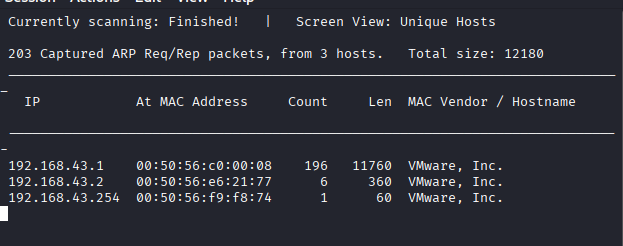
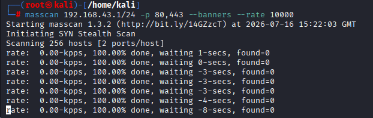
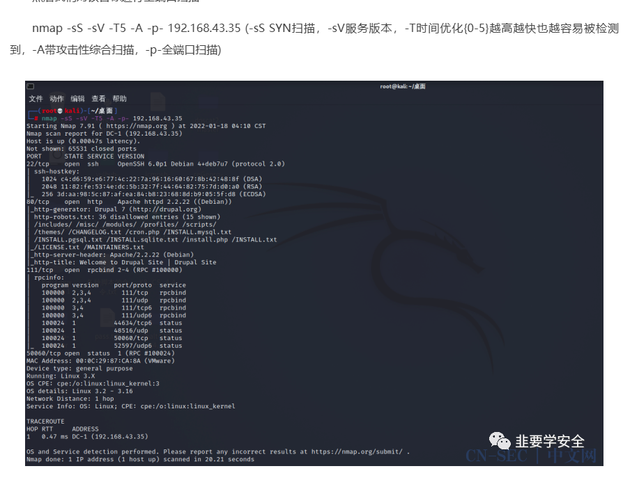
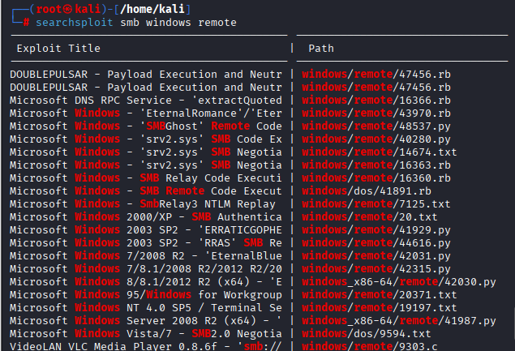
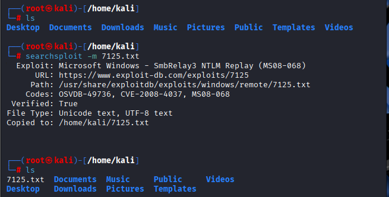
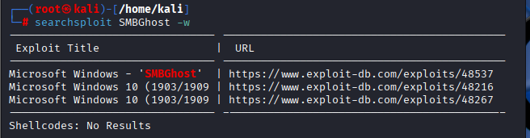

## 收集

### netdiscover

```bash
-f 快速扫描，扫每个网段的1，100，254
-p 被动模式
-r 扫描范围，CIDR
-i 网络接口

-P 扫描后输出文件并退出，其没有参数
-n 扫描最后的源IP，2-253之间
-c 发送每个ARP请求的个数，用于会丢包的环境
-F 自定义pcap filter表达式，默认是arp
-s 每个ARP请求的休眠时间,单位ms,默认1
-I 扫描范围列表文件，文件中每行一个
-m 扫描已知mac地址和主机名的列表文件
-h 帮助，其他详见这里
```

例如：

```bash
netdiscover -i eth0 -r 192.168.43.1/24
```



### masscan

```bash
-p 端口,端口 或者端口范围1-65535
--rate 扫描速率。数据包/秒，默认1000
-o 指定输出格式比如-oJ output.json
--banners 获取服务器横幅信息，比如HTTP.SMTP等协议，无参数
-S 欺骗源IP
-v 详细信息
-e 指定接口


-iL 从文件读取ip列表，等同于--includefile
--excludefile 从文件读取ip列表，黑名单
-wait 指定发包后等待时间
```

例如：



### nmap

最常见的一个，除了速度不咋样其他都行，所以不要一开始就用，先用其他工具缩小范围，masscan的用法在nmap基本都有

基本

```bash
-p
-sV 协议探测
-F 快速扫描，只扫描预设的100个
--open 只显示(可能)开放的端口

--top-ports 扫描指定数量的常用端口
-r 多个端口时顺序扫描，默认是随机的
--exclude-ports 排除端口

以下需要-sV：
--version-intensity 设置探测强度0-9
--version-light/all 对应强度2/9
--version-trace 显示探测过程，仅调试使用
```

主机发现

```bash
-sL 列出目标的范围，没有实际操作，用于确认扫描范围
-sn ping扫描
-Pn 跳过主机发现，默认全在线，对于怀疑禁ICMP的目标使用
-PS TCP SYN探测，masscan使用的方法，默认参数是443
-PA TCP ACK检测，默认参数80
-PU UDP检测，用于路由器，IoT，DNS服务器等，默认参数40125

-PY SCTP协议
-PE ICMP Echo请求，类似ping
-PP ICMP 时间戳请求，如果其他ICMP被禁止的话
-PM ICMP 子网掩码请求，用于探测路由器等网络设备
-PO 后跟协议，用于探测多个协议的复杂网络
--traceroute
```

端口扫描

```bash
-sS TCP SYN扫描，半开扫描
-sT TCP Connect扫描
-sA TCP ACK扫描
-sW 通过TCP窗口大小判断，类-sA
-sM 发送FIN/ACK，隐蔽性较好
```

nmap可以自定义标志位来探测某些基础的检测，如-sN/F/X，以及自定义的--scanflags

其他协议

```bash
-sU UDP扫描
-sO IP协议扫描，就那三个
-sY SCTP INIT扫描，SCTP协议中的TCP SYN扫描
```

nmap还可以用僵尸主机扫描和脚本扫描

```
-sC 带基础漏洞检测，运行默认脚本
--script=xxxx 运行特定脚本
--script-args=user=a,passwd=b 给脚本传参
--script-args-file xxxx.txt 给脚本传文件
--script-updatedb 更新脚本数据库
--script-trace 显示脚本发送和接受的所有数据，调试用
```

探测操作系统

```bash
-O 探测目标系统
--osscan-limit 仅对疑似存在的主机检测系统
--osscan-guess 结果仅是推测
```

防火墙/入侵检测系统（IDS）绕过见原文

包括：伪装源地址，使用诱饵IP，指定源端口，使用代理，附加数据，伪造MAC和发送虚假包等

输出

```bash
一般用XML格式，-oX
-oN/X/S/G G是Grepable格式
-OA 同时输出普通，XML，script kiddle三种格式（？）
```

例如：


其他参考[Nmap 命令详细使用指南（官方参数全覆盖版） - 实践 - gccbuaa - 博客园](https://www.cnblogs.com/gccbuaa/p/19256661)

## web扫描

最基本的目录扫描

```bash
dirsearch -u https://example.com -f -e txt
```

### 历史漏洞查询

```bash
searchsploit smb windows remote
-t 仅匹配标题
--exclude=xxx 排除
也可以搭配grep筛选
-p 47456.rb 获取其更多信息
-m 47456.rb 复制到当前目录
```





可以说是离线版本的Exploit-DB，因此有些东西本地没有，需要联网



## msf

摊牌了，饺子醋：

