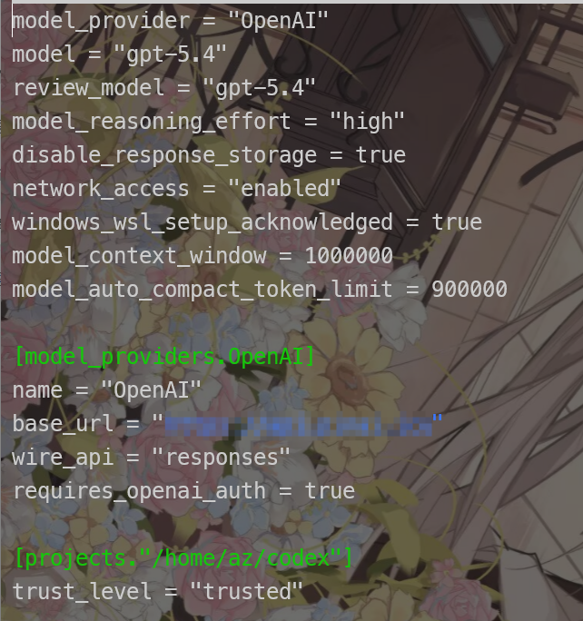

## 闲话

每次学期初，总有一种忙得不知所谓的感觉，等到了学期末，又感觉不到任何紧迫感，整天浑浑噩噩，也总是想着不能这样了，但是到头来也就停留在想一想的程度。

也许是这个学期政治课太多的缘故，总感觉是纯粹的浪费时间。每一个政治老师都在说自己的课不是水课，但是在我看来似乎的却是水课。倒不如说，从初中到现在，也学了很久的政治，但是却没有起到什么作用。

我并不是说想要否认它本身的正确性，但是却不得不将其认为是像物理里常出现的“理想情况”，对于许多都只是泛泛而谈----尽管它本身是基于实践总结出来的规律，但也因此，总是落后于实践的。

## 琐碎

**关于环境变量**

Linux:

```bash
export http_proxy=""  #仅当前会话生效
nano ~/.bashrc     #配置文件，具体位置看用的什么终端，配置具体同上
```

Windoows:

```powershell
[Environment]::SetEnvironmentVariable("http_proxy", $null, "User")
#临时
```

**关于自建代理**

shadowsocks

:::note

比起普通的shadowsocks，更推荐用[shadowsocks-libev](https://github.com/shadowsocks/shadowsocks-libev) 

:::

以Debain系为例

```bash
sudo apt update  
sudo apt install -y shadowsocks-libev  
```

编辑配置文件： `/etc/shadowsocks-libev/config.json `

```json
{
  "server": "0.0.0.0",
  "server_port": 114514,
  "password": "密码",
  "method": "aes-256-gcm",
  "mode": "tcp_and_udp",
  "timeout": 300
}
```

> [!TIP]
>
> method(加密方式)建议`aes-256-gcm`或者`chacha20-ieft-poly1305`
>
> 如果用的好好的突然不能用了，可以尝试换加密方式/端口以规避拦截
>
> 配置时出问题首先要排查防火墙（安全组或者iptables,ufw等），是否又其他应用占用这个端口，然后才是这个

```bash
ss -tulp | grep :8080
```

```powershell
netstat -ano | grep :8080
```

连接是客户端填写的信息要与服务端一致

**关于codex**

其有两个重要的配置文件，分别是：

`~/.codex/auth.json`  APIKey

`~/.codex/config.toml`  配置文件，类似下图配置



base_url可以是中转站站点

一般来说卖apikey的会给这两个文件的内容，只需要复制以及替换key即可

projects可以不用管，这是codex的工作目录，当你在某个文件夹使用codex时，会自动创建一个。如果没有很多显目，只是日用的话，建议旧固定某个文件夹使用，比如我这里的路径实际上是`~/codex`

那么使用时就是：

```bash
cd ~/codex && codex
```

**此时相当于ai在你的电脑的该路径下有了一个终端**

你可以让其操作你的电脑，它当然也可以帮你配置或使用环境，生成文件

> 让ai帮你读日志并分析错误是个很好的选择，你只需要告诉它你要让它文件路径或者软件名，让其自行寻找阅读

:::caution

如果你让它操作文件，尤其是删除文件（像是清理垃圾这种操作），要三思。

:::