## Side Blog

部署完成sideblog后，原本用于生成new_post的批处理文件在我换用另一个电脑时出现了很多的问题：

```powershell
@echo off
chcp 65001
setlocal enabledelayedexpansion
set POSTS_DIR=./posts
if not exist "%POSTS_DIR%" (
    md "%POSTS_DIR%"
    echo 当前目录下无posts目录，已自动创建。请注意这意味着后续需要自行覆盖到可提交的目录下。
)
echo ======================
echo 请输入文章名称（必填）：
echo ======================
:again
set "ARTICLE_NAME="
set /p "ARTICLE_NAME="

if "!ARTICLE_NAME!"=="" (
    echo ❌ 文章名称不能为空，请重新输入：
    goto again
)
for /f "tokens=2 delims==" %%a in ('wmic os get localdatetime /value 2^>nul') do set "datetime=%%a"
set DATE_STR=!datetime:~0,4!-!datetime:~4,2!-!datetime:~6,2!
set FOLDER_NAME=!ARTICLE_NAME!
set FOLDER_PATH=%POSTS_DIR%\%FOLDER_NAME%
set MD_FILE_NAME=%FOLDER_NAME%.md
set MD_FILE_PATH=%FOLDER_PATH%\%MD_FILE_NAME%
if not exist "!FOLDER_PATH!" (
    md "!FOLDER_PATH!"
    echo ✅ 已创建文件夹：!FOLDER_PATH!
) else (
    echo ⚠️ 文件夹已存在：!FOLDER_PATH!
)
echo --- > "!MD_FILE_PATH!"
echo title: !ARTICLE_NAME! >> "!MD_FILE_PATH!"
echo published: !DATE_STR! >> "!MD_FILE_PATH!"
echo description: >> "!MD_FILE_PATH!"
echo image: >> "!MD_FILE_PATH!"
echo tags: [] >> "!MD_FILE_PATH!"
echo category: >> "!MD_FILE_PATH!" 
echo draft: false >> "!MD_FILE_PATH!"
echo --- >> "!MD_FILE_PATH!"
echo.
echo 🎉 生成成功！
echo.
pause
endlocal
```

belike:

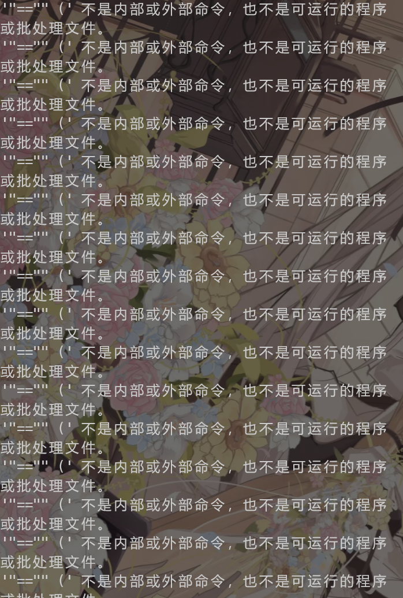

目前并不清楚是不是早上在用平板时提交前误打误撞篡改了这个文件还是怎么回事。
即使让ai重写（lajidoubao），更换编码等都无济于事，有时间的话之后手搓一个。

但是事情并没有那么简单，依旧莫名奇妙报错，这一行并没有什么特殊字符，显然编码有问题

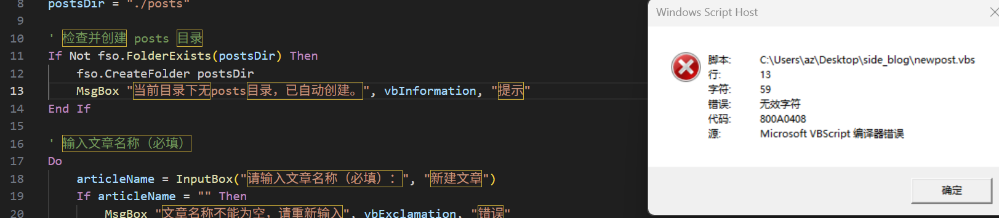

:::tip

vbs只支持ANSI编码，现在绝大多数软件创建的都是UTF-8，这里可以用记事本另存为ANSI格式

:::

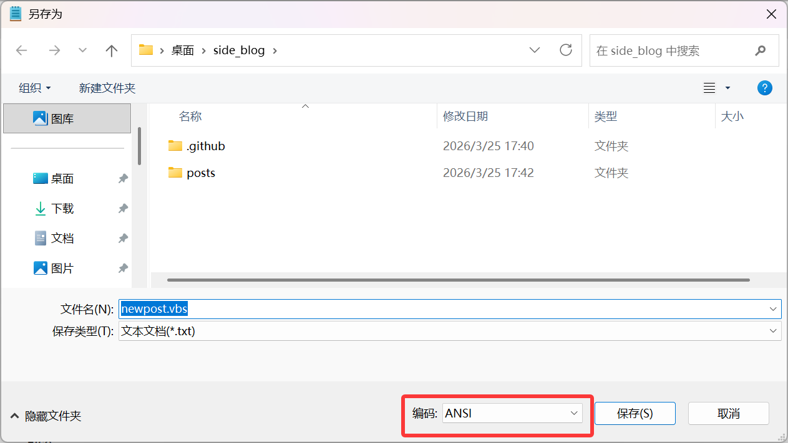

提交上去后才发现有个离谱bug

这东西关不掉，ai没写好逻辑，只能手动结束进程。并且同名会直接覆盖。再跑一次就行。

-----

## Main Blog

最近我的阿里云服务器总是满载，鉴于刚好博客提交也出现了点问题，所以直接清了硬盘从头做。选用了debian13。

首先配置下镜像源

~~~bash
sudo nano /etc/apt/sources.list
```
把原先的注释掉。这里使用阿里云的镜像。由于是debian13，对应下面的trixie（如果是12则是bookworm）
这是debian各个版本的代号
```
deb https://mirrors.aliyun.com/debian/ trixie main contrib non-free non-free-firmware
deb https://mirrors.aliyun.com/debian-security/ trixie-security main contrib non-free non-free-firmware
deb https://mirrors.aliyun.com/debian/ trixie-updates main contrib non-free non-free-firmware
deb https://mirrors.aliyun.com/debian/ trixie-backports main contrib non-free non-free-firmware
~~~

接下里就是要安装easytier了，官方的一键命令代理似乎挂了，所以这里手动下载并ftp上去

```bash
#下载到本地
wget -O 下载路径/easytier.sh "https://raw.githubusercontent.com/EasyTier/EasyTier/main/script/install.sh"
#上传后：
sudo bash 上传路径/easytier.sh install
```

一开始我以为这就完事了，但是：
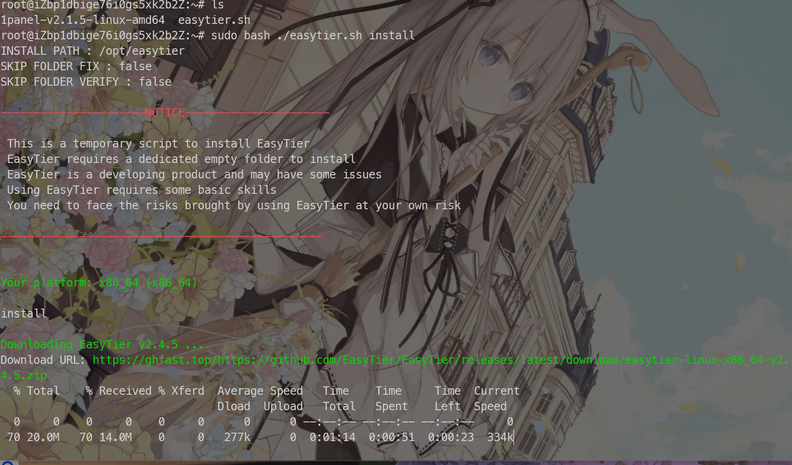

逃不过的下载）最后还是等完了，好在这个代理似乎没有问题

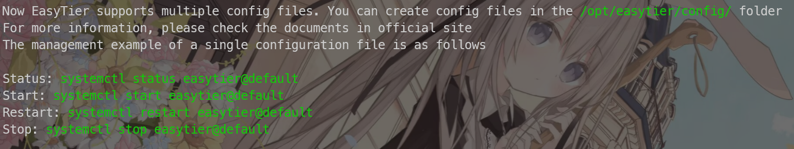

一些要用的命令

:::tip

实际执行时的配置文件对应的是config目录下的文件名，而不是文件中的instance_name

:::

比如这里：

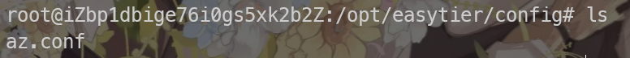

我把default.conf，改名为az.conf，那么上面的命令应类似改为：

```bash
systemctl status easytier@az
```

正常情况下只需要配置账号密码即可，但是由于官方的公共服务器似乎炸了，所以自用的话得有一个公网节点

> 其他要加入组网的设备需要把这里改成指向服务器ip:port。

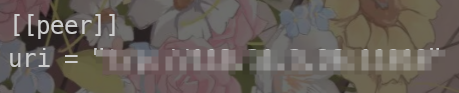

此时要

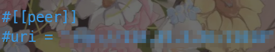

或者直接删除，rpc为web面板，默认的0.0.0.0:0是不启用，如果有需求可以更改

然后

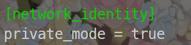

这里多加一句即可（其实是多余的，这一步只是防止被其他人连上，这样这台机器就只能参与当前你这个组网了）

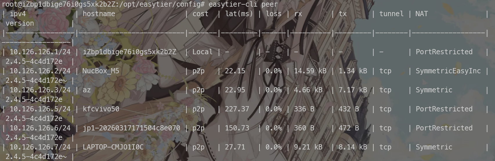

大功告成

接下来就是挑个好看点的blog，之前使用hexo部署，本地构建再推送过于麻烦（自己服务器上做钩子），而且换台电脑就要配个环境，还有一定的权限问题。

因此这里打算弄成和side_blog类似的，使用action来自动构建（仓库只存储posts）

最后选择了 [Hexo Aurora](https://aurora.tridiamond.tech/cn/) 这个主题。

:spotier[花里胡哨，但是还能接受]

因为旧的blog目录是

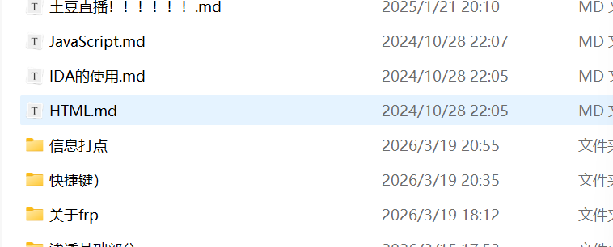

有辅助文件夹的，所以要现在hexo项目根目录下执行

```bash
npm install hexo-asset-link --save
```

下载上面这个插件并且修改下面的部分

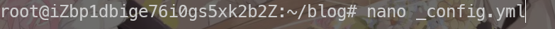

:::caution

下图是修改过的，默认是false

:::


另外还有一点，hexo博客不要把图片等资源直接放在public目录下，而是放在source目录，public目录是通过hexo generate生成的，你的文件应该放在这个source目录下。

一般情况下，当要使用图片时，都是相对于网站url的根目录（如果以/开头）否则是相对当前页面。头像等资源可以直接放在source目录下的随便一个地方，实际使用时，不需要带上source目录

:::tip

例如,假设hexo根目录是blog，将图片放在blog/source/assets/avatar.ico
那么在link="/"的配置下，avatar="/assets/avatar.ico"

:::

hexo本身部署是要推送上来的，但是我这里由于是直接在服务器上运行，所以直接将

hexo server后台运行即可。

这里我使用豆包推荐的pm2（建议都在blog）

```bash
#安装
npm install -g pm2
#后台运行
hexo clean && hexo build
pm2 start "hexo server"
#更改
hexo clean && hexo generate
pm2 restart "hexo server"
```

这样也方便配合action自动化