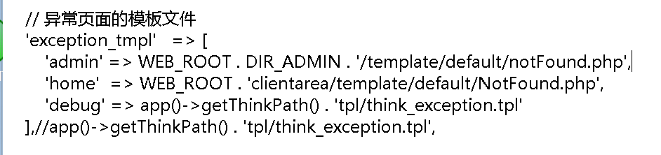

安装和下载php，启用插件（修改php.ini，以及手动下载等操作），mysql安装配置，iis配置cgi等，可以直接咨询AI，一般都不会出错，直接跟ai说在iis上装智简魔方v10就行。

你可能会发现最后一步提交不上去，这是安装脚本的bug，典型的症状就是返回500，如果在web.config中透传了php报错，会发现是找不到host/port

原因的写脚本的人默认你都是域名/ip+端口的形式访问，但是很有可能你已经是绑定好域名的（如果还有其他报错检查下php的session是否正常，php，网站目录是否授予了IIS_USRS以及IUSR权限）

你需要先修复脚本：

把第 445-448 行和 658-661 行都改成这种写法

```php
$server_http = (!empty($_SERVER['HTTPS']) && $_SERVER['HTTPS'] === 'on') ? 'https://' : 'http://';
$host = $_SERVER['HTTP_HOST'] ?? ($_SERVER['SERVER_NAME'] ?? 'localhost');
$domain = $server_http . $host;
```

:::caution

**请注意两个地方都要改**，因为安装完后会显示后台地址，并且整个install文件夹的内容都会被删除。**如果你没有配置后一个，那么回显是异常的！**

------后附，其实不只是这两个地方，这里的核心其实在于错误的使用了

` $arr = parse_url($_SERVER['HTTP_HOST']); `,更快的修改方法就是把文件中的**所有**该行都替换为` $arr = ['host' => explode(':', $_SERVER['HTTP_HOST'])[0], 'port' => explode(':', $_SERVER['HTTP_HOST'])[1] ?? '']; `

:::

如果你真的不幸忘记或者懒得改后一个，那么请去项目根目录（不是网站根目录public）找到config.php，里面有后台目录以及authcode

:::tip

事实上你在安装时就会看到install目录下有个类似的文件，但是里面并没有都是变量占位，你当然也可以在那个时候就修改成你想要的值，但是本人没试过，不知道是否会引发其他bug

:::

如果登录失败，再查数据库确认：

```mysql
SELECT id, name, email, status FROM idcsmart_admin;
```

 如果需要重置密码，config.php 里的 AUTHCODE，然后执行：

```mysql
UPDATE idcsmart_admin
SET password = CONCAT('###', MD5(MD5(CONCAT('这里AUTHCODE', 'NewPass123')))) WHERE id = 1;
```

如果你想要改后台地址，不仅config.php要改，也要将public目录下与原来的后台地址同名的文件夹改成你要改的名字

这里贴一下最后使用的web.config(在public目录下)

```xml
<?xml version="1.0" encoding="UTF-8"?>
  <configuration>
    <system.webServer>
      <httpErrors existingResponse="PassThrough" />

      <defaultDocument>
        <files>
          <clear />
          <add value="index.php" />
          <add value="index.html" />
          <add value="default.htm" />
        </files>
      </defaultDocument>

      <rewrite>
        <rules>
          <rule name="HTTP to HTTPS" stopProcessing="true">
            <match url="(.*)" />
            <conditions>
              <add input="{HTTPS}" pattern="^OFF$" />
            </conditions>
            <action
              type="Redirect"
              url="https://{HTTP_HOST}/{R:1}"
              redirectType="Permanent"
              appendQueryString="true" />
          </rule>

          <rule name="ThinkPHP" stopProcessing="true">
            <match url="^(.*)$" />
            <conditions logicalGrouping="MatchAll">
              <add input="{REQUEST_FILENAME}" matchType="IsFile" negate="true" />
              <add input="{REQUEST_FILENAME}" matchType="IsDirectory" negate="true" />
            </conditions>
            <action type="Rewrite" url="index.php?s={R:1}" appendQueryString="true" />
          </rule>
        </rules>
      </rewrite>
    </system.webServer>
  </configuration>
```

:::caution

需要注意IIS中也要配置好默认页面，否则会出现无论访问什么都是500的问题

:::caution

> 强制https也可以用插件配置，但是无论在哪，插件都要装
>
> <httpErrors existingResponse="PassThrough" />
>
> 是将php的报错透传，如果不是在调试建议注释掉

建议每次调试时有重大的修改（尤其是对php的），都要在命令行重启一次iis(`iisreset`)，网站的修改重启网站即可。

另外这个模板里还有目录错误，bbzl，dedfault页的指向路径不对，缺少pc/moblie

但是根据gpt读的源码，这个问题似乎很大，不是单点错误。



这里不加区分的写路径，但是实际路径是有pc/mobile这一层的

:::tip

以下的部分问题在魔方的后续版本有修复，当时本人搭建时用的是旧版，建议确保自己下载的是最新版的再安装！！！

:::

那我们就顺着写一个php，然后获取正确的资源：

```php
 <?php                                                                                                                                                                            
  $template_catalog = 'clientarea';                                                                                                                                                
                                                                                                                                                                                   
  $ua = $_SERVER['HTTP_USER_AGENT'] ?? '';                                                                                                                                         
  $isMobile = preg_match('/Mobile|Android|iPhone|iPad|iPod|Windows Phone|MicroMessenger/i', $ua) === 1;                                                                            
                                                                                                                                                                                   
  $pcTheme = $_COOKIE['clientarea_theme'] ?? 'default';                                                                                                                            
  $mobileTheme = $_COOKIE['clientarea_theme_mobile'] ?? 'default';                                                                                                                 
                                                                                                                                                                                   
  $theme = $isMobile ? $mobileTheme : $pcTheme;                                                                                                                                    
  $theme = preg_replace('/[^a-zA-Z0-9_-]/', '', (string)$theme);                                                                                                                   
  $theme = $theme !== '' ? $theme : 'default';                                                                                                                                     
                                                                                                                                                                                   
  $type = $isMobile ? 'mobile' : 'pc';                                                                                                                                             
  $themeDir = dirname(__DIR__) . DIRECTORY_SEPARATOR . $type . DIRECTORY_SEPARATOR . $theme;                                                                                       
                                                                                                                                                                                   
  if (!is_dir($themeDir)) {                                                                                                                                                        
      $theme = 'default';                                                                                                                                                          
  }                                                                                                                                                                                
                                                                                                                                                                                   
  $themes = $type . '/' . $theme;                                                                                                                                                  
  ?>                                                                                                                                                                               
  <!DOCTYPE html>                                                                                                                                                                  
  <html lang="en" theme-color="default">                                                                                                                                           
  <head>                                                                                                                                                                           
    <meta charset="UTF-8">                                                                                                                                                         
    <meta http-equiv="X-UA-Compatible" content="IE=edge">                                                                                                                          
    <meta name="viewport"                                                                                                                                                          
      content="width=device-width, initial-scale=1.0, maximum-scale=1.0, minimum-scale=1.0, user-scalable=no">                                                                     
    <title></title>                                                                                                                                                                
    <script>                                                                                                                                                                       
      const url = "/<?php echo $template_catalog?>/template/<?php echo $themes?>/"                                                                                                 
    </script>                                                                                                                                                                      
    <link rel="stylesheet" href="/<?php echo $template_catalog?>/template/<?php echo $themes?>/css/common/element.css">                                                            
    <script src="/<?php echo $template_catalog?>/template/<?php echo $themes?>/js/common/vue.js"></script>                                                                         
    <script src="/<?php echo $template_catalog?>/template/<?php echo $themes?>/js/common/element.js"></script>                                                                     
    <link rel="stylesheet" href="/<?php echo $template_catalog?>/template/<?php echo $themes?>/css/common/common.css">                                                             
    <link rel="stylesheet" href="/upload/common/iconfont/iconfont.css">                                                                                                            
    <script src="/<?php echo $template_catalog?>/template/<?php echo $themes?>/js/common/lang.js"></script>                                                                        
    <script src="/<?php echo $template_catalog?>/template/<?php echo $themes?>/js/common/common.js"></script>                                                                      
    <link rel="stylesheet" href="/<?php echo $template_catalog?>/template/<?php echo $themes?>/css/NotFound.css">                                                                  
  </head>                                                                                                                                                                          
                                                                                                                                                                                   
  <body>                                                                                                                                                                           
    <div class="template">                                                                                                                                                         
      <el-container>                                                                                                                                                               
        <aside-menu></aside-menu>                                                                                                                                                  
        <el-container>                                                                                                                                                             
          <top-menu></top-menu>                                                                                                                                                    
          <el-main>                                                                                                                                                                
            <div class="main-card">                                                                                                                                                
              <div class="content-box">                                                                                                                                            
                <div class="img-box">                                                                                                                                              
                  /template/<?php echo $themes?>/img/common/404.png" alt="">                                                              
                </div>                                                                                                                                                             
                <div class="tips-box">                                                                                                                                             
                  {{lang.status_text1}}                                                                                                                                            
                  <p class="tran-again" @click="goBack">{{lang.status_text2}}</p>                                                                                                  
                </div>                                                                                                                                                             
              </div>                                                                                                                                                               
            </div>                                                                                                                                                                 
          </el-main>                                                                                                                                                               
        </el-container>                                                                                                                                                            
      </el-container>                                                                                                                                                              
    </div>                                                                                                                                                                         
                                                                                                                                                                                   
    <script src="/<?php echo $template_catalog?>/template/<?php echo $themes?>/js/NotFound.js"></script>                                                                           
    <script src="/<?php echo $template_catalog?>/template/<?php echo $themes?>/js/common/axios.min.js"></script>                                                                   
    <script src="/<?php echo $template_catalog?>/template/<?php echo $themes?>/utils/request.js"></script>                                                                         
    <script src="/<?php echo $template_catalog?>/template/<?php echo $themes?>/utils/util.js"></script>                                                                            
    <script src="/<?php echo $template_catalog?>/template/<?php echo $themes?>/api/common.js"></script>                                                                            
    <script src="/<?php echo $template_catalog?>/template/<?php echo $themes?>/components/asideMenu/asideMenu.js"></script>                                                        
    <script src="/<?php echo $template_catalog?>/template/<?php echo $themes?>/components/topMenu/topMenu.js"></script>                                                            
  </body>                                                                                                                                                                          
  </html>      
```

然而不知道什么原因，显示空白，不过问题不大。

其他默认页也有这个问题，建议是别修了，500就500吧。


最后记得：

```php
<!-- <httpErrors existingResponse="PassThrough" /> -->
```

