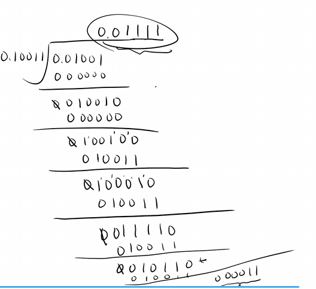

### 一. 各种运算

#### 1.1 求原，反，补码

以下全部都是

**定点数**

##### 1.1.1 整数

PS：原码懒得思考直接除就得了

正数反补不变

负数除符号位按位取反，补码为反码+1

##### 1.1.2 小数

正数

23/32：其中23对应10111，32对应0.00000（因为32是2的5次方，补5个0）

:::caution

如果题目要求用n位表示，请补满到小数点后n-1位（因为小数点前的是符号位，当为负数时，该位为1）后再进行转换！！！

即**必须加在最低有效位**（LSB）上

:::

将23的值填入对应的位置，即得到0.10111

正数反补不变

-35/64

原码：35对应100011，-64对应1.000000，故原码为1.100011

负数除符号位按位取反，补码为反码+1

-0.875

使用乘2取整法

0.875x2=1.75(取出1)

0.75x2=1.5(取出1)

0.5x2=1.0(取出1)

剩0，结束

故小数部分是111，对应的整个二进制是1.111，:spoiler[也可以认为是0.5+0.25+0.125]

同样需要补齐后转换

:::note

对于一个整数+小数而言，转换时最高位为符号位！（定点，需要分别补齐后操作），**只有纯小数才是将小数点前一位作为符号位**

:::

#### 1.2 IEEE754

##### 1.2.1 十进制转IEEE754

该标准是32位短浮点数的存储标准

如11.375

首先将其转换为2进制：1011.011

:::note

这个转换不要带符号！因为符号位会被表现在S，这里转换只是为了得到E，M，这两者不应包括原来数的符号！

:::

再次转化成：$1.011011\times2^3$(小数点左移三位)

分三个部分

- S（符号位，0正1负，**1位**）
- E（阶码，对应上面的3，**8位**）
- M（尾数，对应上面具体的数据，**23位**）

E使用移码存储E=e+127，如上面的3，对应的130，故其移码(阶码)是10000010

M是011011（小数部分，整数部分的1省略掉），故其移码是011011...（23位中后续没有用到的位也要补0）

一般来说用16进制来表示即$(41360000)_{16}$

这个数如果是分数？如25/64

对应的二进制：0.011001，即$1.1001\times2^{-2}$

E=e+127=125，即$(01111101)_2$

M为1001...

最后整体转为16进制

##### 1.2.2 IEEE754转十进制

如$(C2370000)_{16}$转10进制

首先展开

1	10000100	011011100...

分别对应S，E，M

符号位为1，即负数

阶码是128+4-127=5，也就是这个数是$\times2^5$

尾数是0110111

对应定点数：$-1.0110111\times2^5$，即-101101.11

:::warning

这里得到的可不是十进制！！！！

:::

转换为10进制：-45.75

#### 1.3 双符号位计算

(1) x=10011， y=11001，x+y
$$
[x]_补=010011，[y]_补=011001\\
正数只需要多加一个符号位0，这个符号位不是这个数本身的\\
\begin{array}{r}
0010011\\
+0011001 \\
\hline
0101100
\end{array}\\
$$
符号位：

- 00，正数
- 01，上溢
- 10，下溢
- 11，负数

（2）x=00011，y=-11011，x+y
$$
[x]_补=000011，[y]_补=100101\\
负数添加的符号位变成了1\\
\begin{array}{r}
0000011\\
+1100101 \\
\hline
1101000
\end{array}\\
$$
得到的是一个负数的补码（双符号位），转回原码：

$(x+y)_补=(101000)_补=(111000)_原=-11000$

#### 1.4 单符号位计算

(1) x=10011， y=11001，x-y
$$
[x]_补=010011，[y]_补=011001\\
[-y]_补=100111\\
[-y]是对[y]全部按位取反（包括符号位），再+1得到\\
\begin{array}{r}
010011\\
+100111 \\
\hline
111010
\end{array}\\
$$
同理

$(x-y)_补=(111010)_补=(100110)_原=-00110$

(2)x=11011，y=-10001，x-y
$$
[x]_补=011011，[y]_补=101111\\
[-y]_补=010001\\
[-y]是对[y]全部按位取反（包括符号位），再+1得到\\
\begin{array}{r}
011011\\
+010001 \\
\hline
101100
\end{array}\\
$$
从结果来看**这是个负数**，但显然这个正数减去负数是得不到负数的，因此可以判断是发生了**上溢**

> 正数算出为负是上溢， 反之若本身应该是负数的算出为正数，则是下溢

#### 1.5 阵列乘法器求x*y

x=10011，y=-01101

原码阵列乘法器
$$
[x]_原=010011,[y]_原=101101\\
[x]_补=010011,[y]_补=110011\\
|x|=10011,|y|=01101\\
去掉符号位\\
|x*y|=0011110111\\
此处用绝对值按照竖式乘法即可，需要补齐到位数相乘\\
由于结果一定为负数\\
[x*y]_原=10011110111\\
x*y=-0011110111
$$
如果是补码阵列乘法器，则$[x*y]_原=10011110111==>[x*y]_补=11100001001$

#### 1.6 除法运算

x=01001，y=10011
$$
x,y同乘2^{-5}\\
x=0.01001,y=0.10011\\
商：0.01111\\
余：0.0000000011\times2^5=0.00011
注意商是不需要乘回去的，只有余数需要
$$
附除法过程：

#### 1.7 浮点运算

设阶码3位，尾数6位，按浮点运算，完成x+y以及x-y

$x=2^{-011}\times0.110110,y=2^{-001}\times(-0.010101)$

:::tip

小阶向大阶看齐，此处-011<-001，所以将x化为$x=2^{-001}\times0.00110110$

:::

随后尾数相加减，结果再格式化即可

$x+y=2^{-001}\times{-0.00011110}=2^{-100}\times{-0.111100}$

x-y类似

### 二. 存储器相关

#### 2.1 DRAM芯片组成

2.1.1 位数(字长)扩展

2.1.2 字扩展

2.1.3 字位扩展

以上全略

#### 2.2 主存Cache映射

2.2.1 全相连映射方式

2.2.2 直接映射

2.2.3 组相连映射

#### 2.3 机械硬盘

